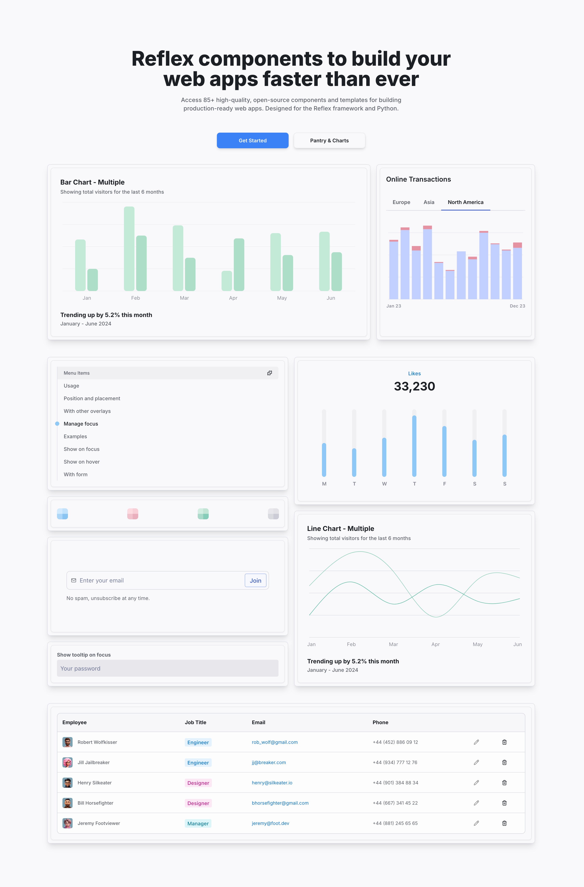

# SapphireUI

Pre-designed UI components built with Reflex. Easily copy and paste into your own app.

  

## Pantry

Visit the [Pantry](https://sapphireui-teal-book.reflex.run/pantry/accordions/) section to view the available pre-built components.

## Charts

Visit the [Charts](https://sapphireui-teal-book.reflex.run/charts/area-charts/) section to view the available pre-built charts for data visualization.

## Contributing

Please read this [guide](CONTRIBUTING.md) for more information on how to contribute.

## License

Licensed under the [MIT license](./LICENSE).
